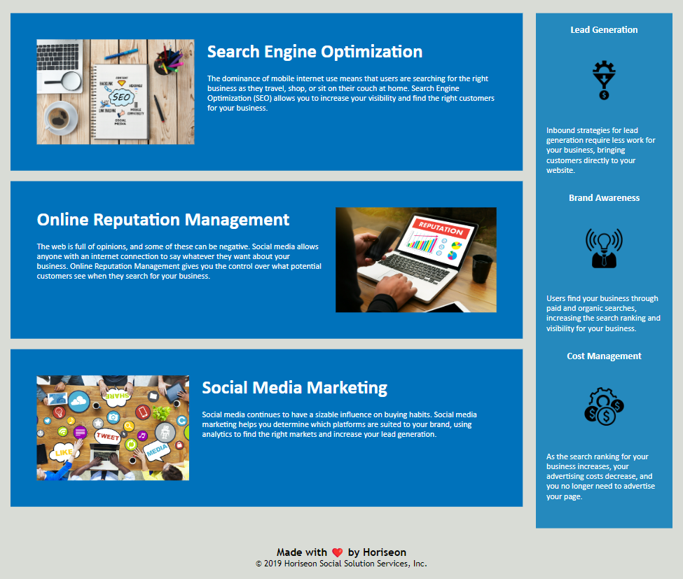

# edx-bootcamp-challenge-1

## Description
This is a on-the-job ticket challenge as part of the edx front end bootcamp. The files contains html and css for a web page for a client. As a developer I was assign to make the client application more accessible to be more optimized search engines like Google and users with disabilities that find it difficult to access the website.

In order to achieve this goal, more semantic html tags are used throughout the code, this will benefit the web application in couple of ways; search engine will consider the web content as important keywords thus improving the SEO ranking, screen readers can use it to help visually impaired users to navigate through the page and the overall code becomes significantly easier to review/find blocks of code. Aswell as adding more classes with naming convention in mind. 
The css files has been commented to ensure that its tells the user exactly the purpose of each css selector and the layout css has been organized to follow the html structure for more convenience, this again will make it much easier to review and find blocks of code for futher improvement or de-bugging.

### User Story

```
AS A marketing agency
I WANT a codebase that follows accessibility standards
SO THAT our own site is optimized for search engines
```

### Acceptance Criteria

Your website must meet accessibility standards. You can achieve this completing the following:

* Semantic HTML elements can be found throughout the source code
* HTML elements follow a logical structure independent of styling and positioning
* Image and icon elements contain accessible `alt` attributes
* Heading attributes fall in sequential order
* Title elements contain a concise, descriptive title

### Mock-Up

The following image shows the web application's appearance and functionality:

 




## Deployed Link
github page url: https://tinxtin.github.io/bootcamp-challenge-1/